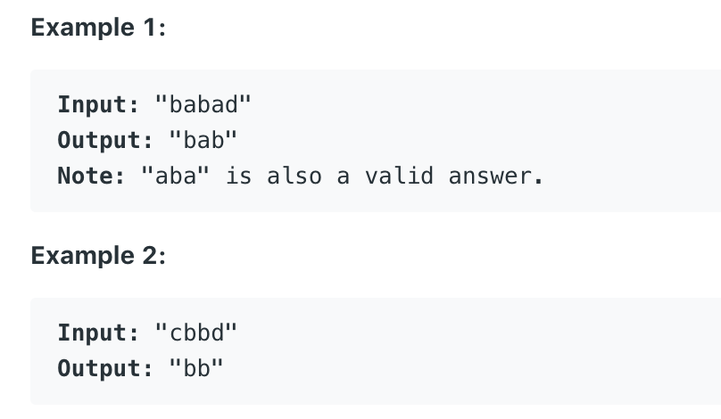

# How to find **The Longest Palindromic Substring**

**Author: [labuladong](https://github.com/labuladong)**

**Translator: [Lrc123](https://github.com/Lrc123)**

Palindrome questions are very common in the Interview, this article provides some insights about palindromic problem.

To specific :
> A palindrome is a word, number, phrase, or other sequence of characters which reads the same backward as forward, such as madam, racecar. 
[reference](https://en.wikipedia.org/wiki/Palindrome)

For example: `aba` and `abba` are both palindromic, because they are symetric strings, that you can read each of them in reversed order, and you can just get a same string.

Notice: palindrome string could be in either odd length or even length, a good solution would be **double pointers**. Next, I'll show you how **doulbe pointers** work in a real leetcode problem.



```cpp
string longestPalindrome(string s) {}
```

### 1. Thinking

Given a string s, find the longest palindromic substring in s.

A very interesting pespective: 1. Reversing s in to s' 2. Finding the longest common substring.

For instance, a string `abacd`, a reversed version is `dcaba`, and the longest common string is `aba`, seemingly perfect.

However, it would be wrong when we apply to `aacxycaa`, which a reversed version would be `aacyxcaa`, then the longest common substring turns out to be `aac`. But, what we need should be `aa`.

Although this way has its faults, **we can still get some inspirations that we can transform a problem seemingly hard into another simpler problem that we can understand easier.**

Now, **the double pointers**

**Core idea: start a scanner from the mid point of the string** 
we represent the idea into pseudo code:

```python
for 0 <= i < len(s):
    find a palindrome that set s[i] as its mid point
    update the answer
```

When the length of string is even, for instance: `abba`, the code above would not work.

So, a better version here :
```python
for 0 <= i < len(s):
    find a palindrome that set s[i] as its mid point
    find a palindrome that set s[i] and s[i + 1] as its mid point
    update the answer
```

PS: you may encounter some problems like : outofIndex error. Don't worry, we'll fix them later.

### 2. Implementation

a function implementation:

```cpp
string palindrome(string& s, int l, int r) {
    // avoid outOfIndex error
    while (l >= 0 && r < s.size()
            && s[l] == s[r]) {
        // scanning toward both directions
        l--; r++;
    }
    // return a palindrome that set s[l] and s[r] as mid point
    return s.substr(l + 1, r - l - 1);
}
```

Why we need both pointer `l` and pointer `r`? **In this way, we can handle palindrome strings in odd and even length**

```python
for 0 <= i < len(s):
    # find a palindrome that set s[i] as its mid 
    palindrome(s, i, i)
    # find a palindrome that set s[i] and s[i + 1] as its mid  
    palindrome(s, i, i + 1)
    update the answer
```

Completed code solution:

```cpp
string longestPalindrome(string s) {
    string res;
    for (int i = 0; i < s.size(); i++) {
        // find a palindrome that set s[i] as its mid 
        string s1 = palindrome(s, i, i);
        // find a palindrome that set s[i] and s[i + 1] as its mid  
        string s2 = palindrome(s, i, i + 1);
        // res = longest(res, s1, s2)
        res = res.size() > s1.size() ? res : s1;
        res = res.size() > s2.size() ? res : s2;
    }
    return res;
}
```


Thus, this leetcode problem is solved. Now, we get:

Time complexity: O(N^2) 

Space complexity: O(1)


By the way, a dynamic programming approach can also work in this problem in a same time complexity. However, we need at least O(N^2) spaces to store DP table. 
Therefore, in this problem, dp approach is not the best solution.

In addition, **Manacher's Algorithm** requires only O(N) time complexity. You readers can search it through the Internet by your own interests. It should be very interesting.


**Stick to original high-quality articles, and strive to make clear the algorithm problems. Welcome to follow my Wechat official account "labuladong" for the latest articles.**

