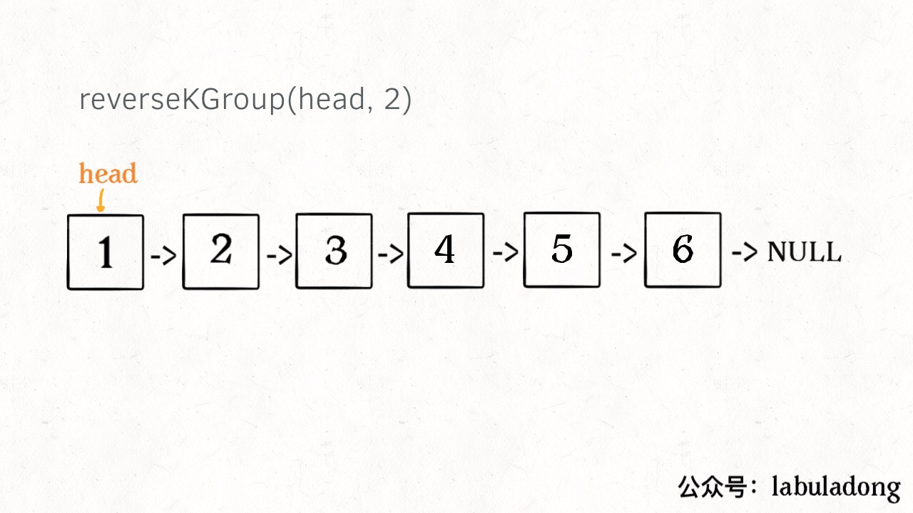
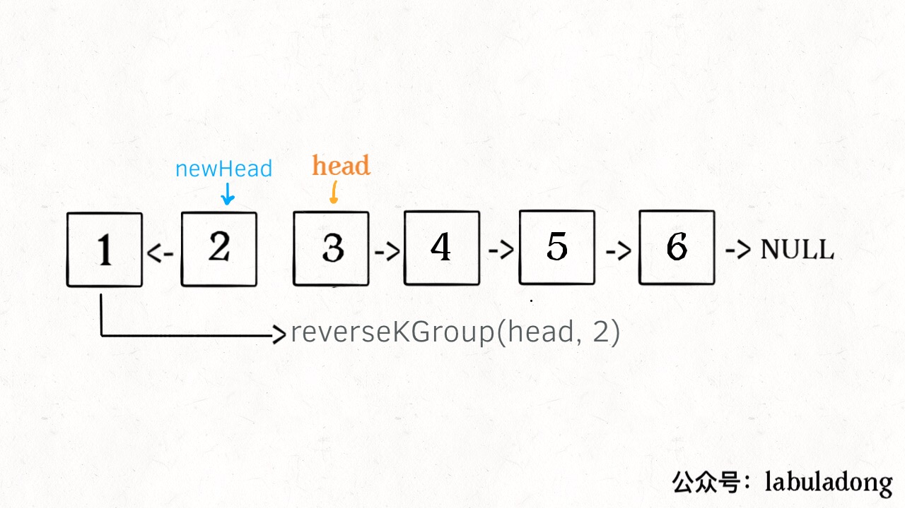
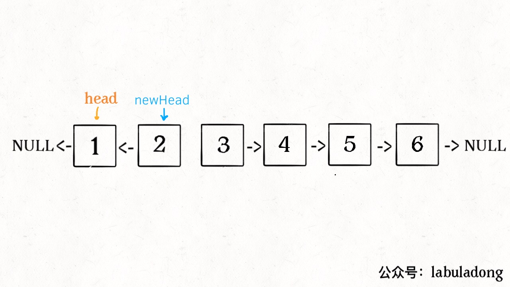
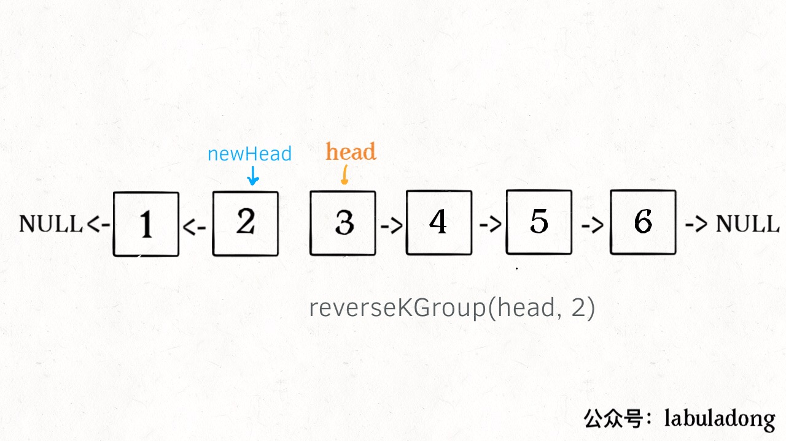
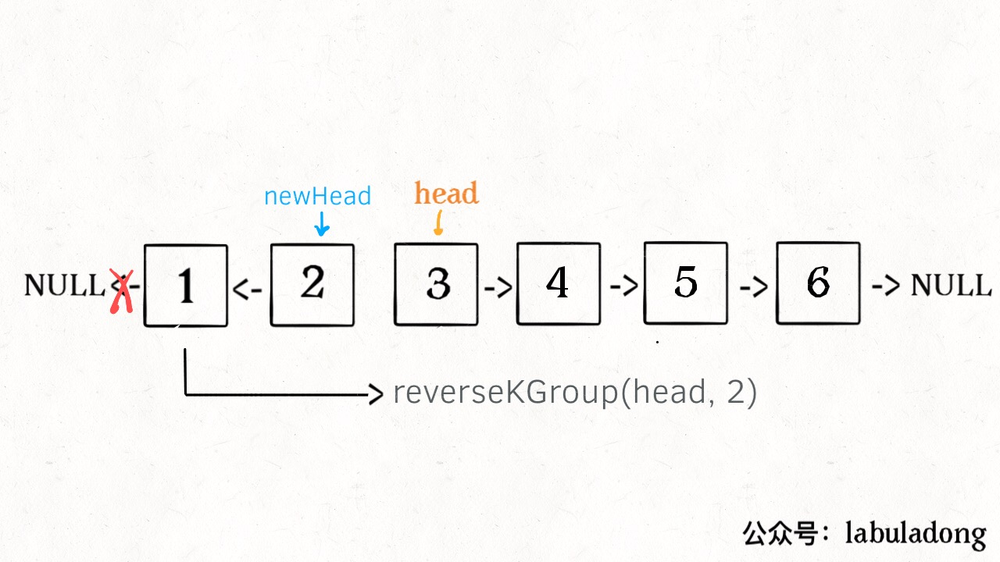
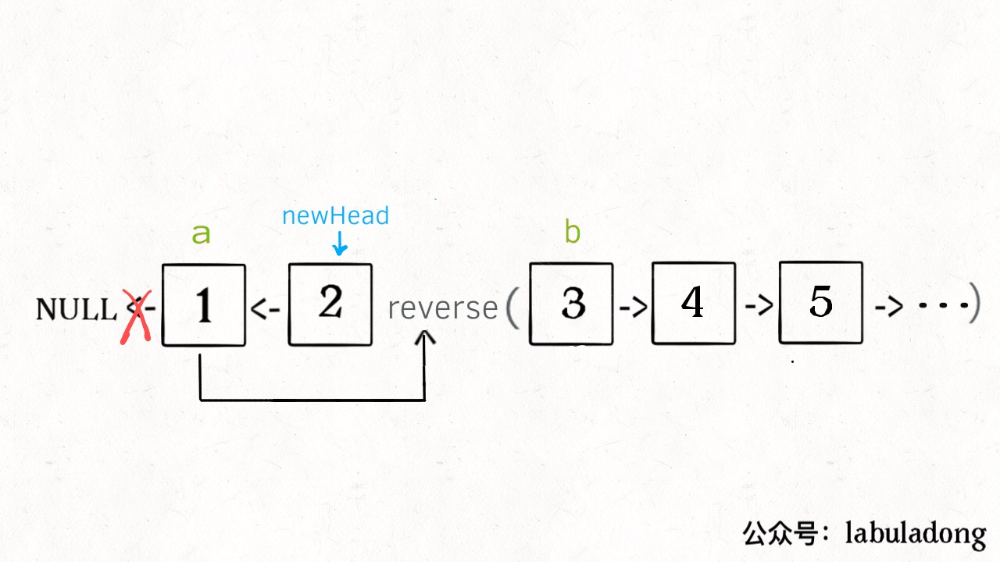
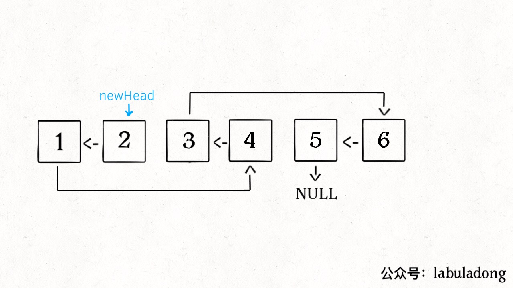

#  How to reverse nodes in k-group

**Translator: [Justin](https://github.com/Justin-YGG)**

**Author: [labuladong](https://github.com/labuladong)**

We talked about the way how to reverse the part of linked list recursively in [previous article](..算法思维系列/学习数据结构和算法的框架思维.md). Some readers may wonder how to reverse the whole linked list. We also need to use the function of linked list reversion in this article, so we might as well use the recursive method to solve it.

The problem we need to solve is [Reverse Nodes in k-Group](https://leetcode.com/problems/reverse-nodes-in-k-group/). It's easy to understand what that means.

> Given a linked list, reverse the nodes of a linked list k at a time and return its modified list.

> k is a positive integer and is less than or equal to the length of the linked list. If the number of nodes is not a multiple of k then left-out nodes in the end should remain as it is.

> Example:

>   Given this linked list: `1->2->3->4->5`
>   For k = 2, you should return: `2->1->4->3->5`
>   For k = 3, you should return: `3->2->1->4->5`

We may often encounter this problem in Interview and its difficulty is **Hard** on LeetCode. But is it really so tough?

Actually, the problems of basic data structure are not difficult. We can solve them by splitting the big problem into the small one step by step. I will show you how to do that below.

### Analysis

As mentioned in the previous article [the thinking framework of learning data structure](../算法思维系列/学习数据结构和算法的框架思维.md), linked list is a kind of data structure with recursion and iteration. On second thought, we can find that this problem can be solved by recursion.

What does recursion mean? We can try to understand it with the help of the example below.

We call `reverseKGroup(head, 2)` on the linked list so that we can reverse the linked list with 2 nodes as a group.



What should we do next to deal with the remaining nodes after reversing the first two nodes？The remaining nodes also form a linked list but it's shorter than origin linked list.It turns out to be a subproblem of primal problem.



We can call `reverseKGroup(cur, 2)` recursively because there is
the same structure between primal problem and subproblem. So, this is so called recursion.

We can find out the basic procedure of algorithm to solve the problem after understand recursion.

**1.Reverse the first k nodes**



**2. Reverse list with k+1 node as head by calling reverseKGroup recursively**



**3. Merge the results of above two steps**



Note, there usually is a base case in recursion function. The base case of this problem is **If the number of nodes is not a multiple of k then left-out nodes in the end should remain as it is**. I will emphasize it in code.

### Coding

First, we need to implement a `reverse` function to reverse the elements in a interval. Before that, let's simplify the problem and consider that how to reverse the linked list with a given head node.

```java
// reverse the linked list with node a as head
ListNode reverse(ListNode a) {
    ListNode pre, cur, nxt;
    pre = null; cur = a; nxt = a;
    while (cur != null) {
        nxt = cur.next;
        // reverse node one by one
        cur.next = pre;
        // update pointer
        pre = cur;
        cur = nxt;
    }
    // return head node of the reversed linked list
    return pre;
}
```


It's easy to understand the iteration with the help of animation above.

When we reverse the linked list with node `a` as head, indeed, we reverse nodes between node `a` and `null`.

How should we do to reverse nodes between node `a` and `b`?

Just change the function signature and change `null` to` b` in the above code

```java
/** reverse the nodes of interval [a, b), which is left-closed and right-open */
ListNode reverse(ListNode a, ListNode b) {
    ListNode pre, cur, nxt;
    pre = null; cur = a; nxt = a;
    // just change the condition of quit
    while (cur != b) {
        nxt = cur.next;
        cur.next = pre;
        pre = cur;
        cur = nxt;
    }
    // return head node of the reversed linked list
    return pre;
}
```

So far, we have finished the function of reversing the part of the linked list. Next, we will work on the function of `reverseKGroup` according to the previous design.

```java
ListNode reverseKGroup(ListNode head, int k) {
    if (head == null) return null;
    // interval [a, b) includes k nodes to be reversed
    ListNode a, b;
    a = b = head;
    for (int i = 0; i < k; i++) {
        // base case
        if (b == null) return head;
        b = b.next;
    }
    // reverse first k nodes
    ListNode newHead = reverse(a, b);
    // merge all reversed internals
    a.next = reverseKGroup(b, k);
    return newHead;
}
```

Note that the interval of `reverse` function is `[a, b)`.



We will not give more details about the recursive part again. The result fully meets the meaning of the question:



### More

Only a few people read the algorithm articles related to basic data structure according to the page view. Most of people tend to read the articles related to dynamic programming because they  often show up in Interview. But what I want to share is basic data structure and algorithm matter a lot and all complicated problems evolve from simple problems.

By the way, remember that **practice makes perfect**.

[previous：how to find the longest palindromicsubstring](../Interview/The Longest Palindromic Substring.md.md)

[next：how to valid parentheses](../Interview/合法括号判定.md)

[catalog](../README.md#目录)