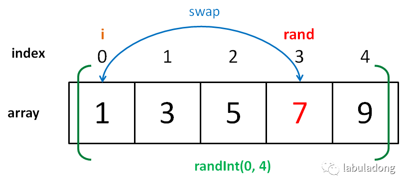
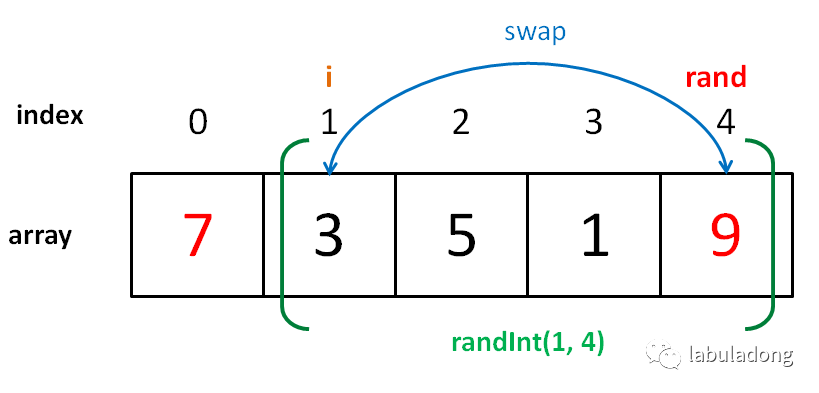
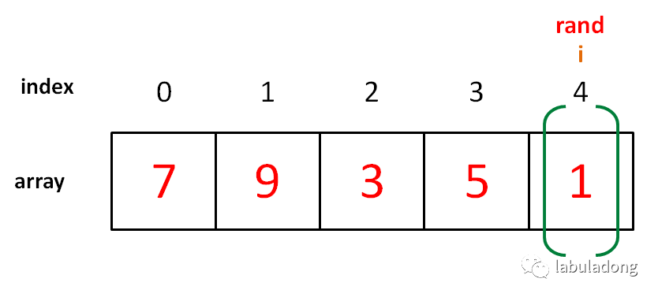
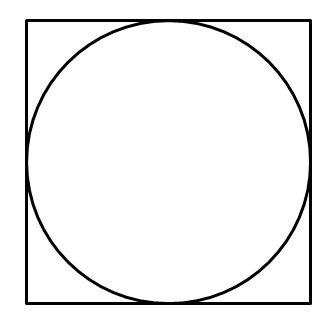
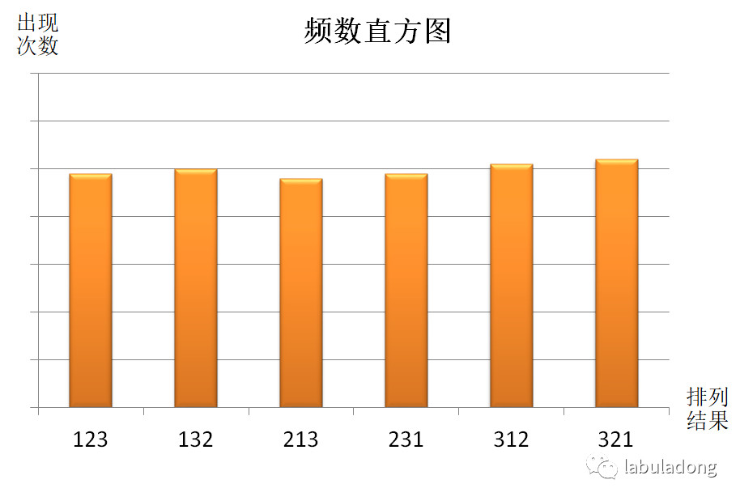
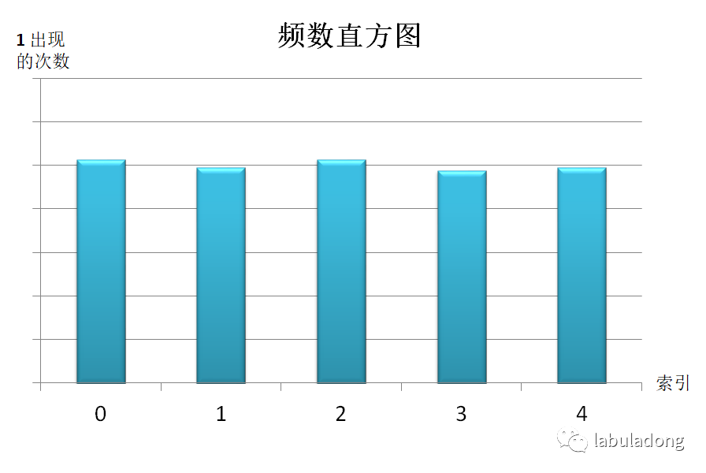

# Shuffle Algorithm

**Translator: [realism0331](https://github.com/realism0331)**

**Author: [labuladong](https://github.com/labuladong)**

I know people have all kinds of fancy sorting algorithms, but if you had to scramble an array, would you be able to do that? Even if you come up with an algorithm, how do you prove that your algorithm is correct? An unordered algorithm is not like a sorting algorithm, the only result is easy to check. But there are many different kinds of "unordered" , so, how can you prove that your algorithm is "really unordered" ?

So we have two problems:
1. What's the meaning of  "real mess" ?
2.  What algorithms are designed to disrupt arrays in order to achieve "true chaos" ?

This algorithm is called a random shuffle algorithm or a shuffle algorithm.

This paper is divided into two parts, the first part of the most commonly used shuffle algorithm. Because the details of the Algorithm is error-prone, and there are several variants, although there are subtle differences but are correct, so this article to introduce a simple general idea to ensure that you write a correct shuffle algorithm. The second part explains the use of "Monte Carlo method" to test whether our disruption is real. Monte Carlo Method's ideas are not difficult, but they have their own characteristics.

### 1. Shuffle Algorithm

Such algorithms rely on the exchange of randomly selected elements to obtain randomness, directly look at the code (pseudo-code) , the algorithm has four forms, both of them are correct:

```java
// A random integer in the closed interval [min, Max] is obtained
int randInt(int min, int max);

// First case
void shuffle(int[] arr) {
    int n = arr.length();
    /*** The only difference is these two lines ***/
    for (int i = 0 ; i < n; i++) {
        // Randomly select an element from i to the last
        int rand = randInt(i, n - 1);
    /*********************************************/
        swap(arr[i], arr[rand]);
    }
}

// Second case
    for (int i = 0 ; i < n - 1; i++)
        int rand = randInt(i, n - 1);

// Third cse
    for (int i = n - 1 ; i >= 0; i--)
        int rand = randInt(0, i);

// Forth case
    for (int i = n - 1 ; i > 0; i--)
        int rand = randInt(0, i);

```

**To analyze the correctness of the shuffle algorithm: The result must have n! possibilities , or it's a mistake. **This is easy to explain, because an array of length n has a full permutation of n! possibilities. That is to say, the total number of disruption results are n! possibilities . The Algorithm must be able to reflect this fact in order to be correct.

Let's use this rule to analyze the correctness of **the first one**:

```java
// Suppose an arr is passed in like this
int[] arr = {1,3,5,7,9};

void shuffle(int[] arr) {
    int n = arr.length(); // 5
    for (int i = 0 ; i < n; i++) {
        int rand = randInt(i, n - 1);
        swap(arr[i], arr[rand]);
    }
}
```

At the first iteration of the for loop, `i=0`, the range of  `rand`  is `[0,4]`, and there are five possible values.



On the second iteration of the for loop, `i=1`,the range of ` rand`  is `[1,4]`, and there are four possible values.



And so on, until the last iteration, `i=4`, and  the range of  `rand`  is `[4,4]`, and only one possible value.



As you can see, all the possible outcomes of this process is `n! = 5! = 5*4*3*2*1` ，so the algorithm is correct.

In **the second case**, the previous iterations are the same, with only one iteration missing. So on the last iteration`i = 3`，the range of `rand` is `[3,4]`, and there are two possible values.。

```java
// Second case
// arr = {1,3,5,7,9}, n = 5
    for (int i = 0 ; i < n - 1; i++)
        int rand = randInt(i, n - 1);
```

So all the possible outcomes of the whole process are still `5*4*3*2 = 5! = n!` ，because multiplying by one is optional. So that's correct.

If you understand all of the above, you'll see that **the third way** is the first way, just iterating the array from back to front; **the fourth way** is the second way which is also iterating the array from back to front. So they're both correct.

If the reader had thought about the Shuffle Algorithm, he might have come up with the following, but **that would be a mistake**:

```java
void shuffle(int[] arr) {
    int n = arr.length();
    for (int i = 0 ; i < n; i++) {
        // Every time, elements are randomly selected from 
        //the closed interval [0, n-1] for exchange 

        int rand = randInt(0, n - 1);
        swap(arr[i], arr[rand]);
    }
}
```

Now you can see why this is wrong. Because all the possible outcomes of this notation are $n ^ n $, not $N!$ and $n ^ n$ can't be $N!$ integral multiples of $.

So, for example `arr = {1,2,3}`，the correct result should be$3!= 6$ , but there are a total of $3 ^ 3 = 27 $possible results. Since 27 can not be divisible by 6, there must be some cases that are "biased, " meaning that some cases are more likely to occur, so the disruption is not really chaotic.

 we explained the correct criteria of shuffle algorithm through our intuition， there is no mathematical proof, I think we do not bother to prove. For probability problems, we can use the Monte Carlo Method for simple verification.

### 2. Monte Carlo method

**The measure of the correctness** of a shuffle algorithm, or a random shuffle algorithm, is that **the probabilities of each possible outcome must be equal, that is, random enough.**

If probability equality is not strictly proved mathematically, it is possible to use the Monte Carlo method approximation to estimate whether the probability is equal and whether the result is sufficiently random.

In high school, I had remembered there was a math problem: randomly dot a square with a circle inside it, tell you the total number of dots and the number of dots falling in the circle, let you calculate Pi.



The trick is to use Monte Carlo method: When you hit enough dots, the number of dots can be approximated to the area of the graph. By the area formula, Pi can be easily deduced from the area ratio of a square to a circle. Of course, the more points played, the more accurate the calculation of Pi, fully reflects the truth of the miracle of force.

Similarly, we can shuffle the same array one million times, counting the number of various results, regrading the frequency as the probability, it is easy to see whether the shuffle algorithm is correct. The overall idea is very simple, but there are some skills to implement, the following are brief analysis of several implementation ideas.

**The first idea** is to enumerate all the permutations of the Array arr and make a histogram (assuming `arr = {1,2,3}`) :



After each shuffle algorithm, add one to the frequency corresponding to the disruption result, repeat 1 million times, if the total number of each result is almost the same, that each result should be the same probability. Write pseudo code for this idea:

```java
void shuffle(int[] arr);

// Monte Carlo
int N = 1000000;
HashMap count; // As histogram
for (i = 0; i < N; i++) {
    int[] arr = {1,2,3};
    shuffle(arr);
    // At this time, arr has been disrupted 
    count[arr] += 1；
}
for (int feq : count.values()) 
    print(feq / N + " "); // frequency
```

This test is possible, though one might ask, the whole array of arr is n! Species (n is the length of arr) , if n is larger, isn't that the explosion of space complexity?

Yes, but as a verification method, we don't need n too big, so we'll just try arr of length 5 or 6, because we just want to compare the probabilities to see if it's correct.

**The second way** to think about there is only one 1 in the arr array,others are all 0 . So we're going to mess up the Arr a million times, and we're going to record the number of occurrences of 1 per index, and if the number of  per index is about the same, then we're going to say that the probability of any kind of mess is equal.

```java
void shuffle(int[] arr);

// Monte Carlo method
int N = 1000000;    
int[] arr = {1,0,0,0,0};
int[] count = new int[arr.length];
for (int i = 0; i < N; i++) {
    shuffle(arr); // disrupt arr
    for (int j = 0; j < arr.length; j++) 
        if (arr[j] == 1) {
            count[j]++;
            break;
        }
}
for (int feq : count) 
    print(feq / N + " "); // frequency
```



This idea is also feasible, and to avoid the space complexity of factorial level, but more nested for loop, time complexity a little higher. However, since our test data volume will not be very large, these problems can be ignored.

In addition, the careful reader may notice that the two lines of thought above state that Arr is in a different position, one inside the for loop and the other outside the for loop. Actually, the effect is the same, because our algorithm always messes the Arr, so the order of Arr doesn't matter, as long as the elements stay the same.

### 3. Final summary

In the first part of this paper, the Shuffle Algorithm (random scrambling algorithm) is introduced. Through a simple analysis technique, four correct forms of the algorithm are proved, and a common wrong writing method is analyzed, I'm sure you'll be able to write the right Shuffle Algorithm.

In the second part, I write the criterion of the correctness of the Shuffle Algorithm, that is, the probability of each kind of random result must be equal. If we don't use rigorous mathematical proof, we can use Monte Carlo method to perform miracles, roughly verifying that the algorithm is correct. The Monte Carlo method has  different approaches, but it doesn't have to be strict, because we're just looking for a simple validation.


